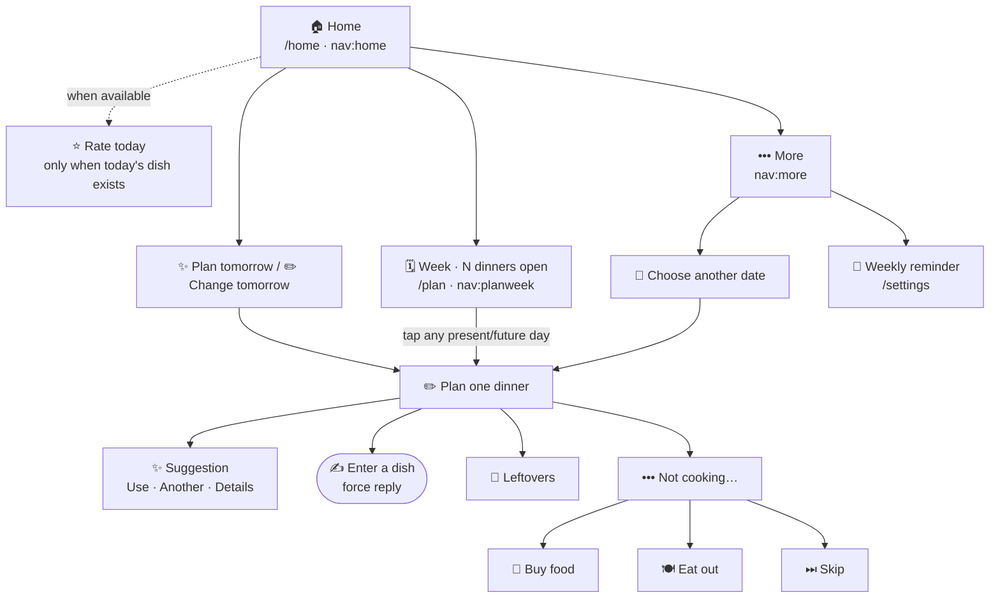

# Telegram menu state machine

The bot deliberately exposes only three Telegram commands:

```text
/home      dashboard and next actions
/plan      current week's dinners
/settings  weekly reminder and help
```

`/start`, `/meals`, and `/ask` are hidden compatibility aliases. Existing
messages that contain the older `nav:meals`, `nav:week`, or `nav:ask`
callbacks also remain valid. `/meals` and those older meal/week callbacks now
open the combined weekly plan instead of a separate Meals hub or read-only
week screen.

Every inline panel edits the Telegram message that contains it. Commands,
typed replies, and feedback photos create new response messages.

## Compact menu tree



The week panel is both the overview and the editor. Every present or future day
is tappable, including a day already marked with `✅`; tapping it changes that
dinner. Past days stay visible in the summary but have no button. This removes
the former Meals hub, separate read-only Full week screen, and Change a meal
detour from the normal path.

Questions are not menu items. In a private chat, ordinary text is answered. In
a group, mention the bot or reply to one of its messages. A photo can attach
to the current feedback flow.

## Planning origins and Back

A planning callback may end with a one-letter origin. Every later screen keeps
that letter, so Back returns to the panel the user actually came from:

| Letter | Origin | Back target |
| --- | --- | --- |
| `h` | Home / tomorrow | `nav:home` |
| `w` | Weekly plan / Sunday reminder | `nav:planweek` |
| `c` | More → another date | `nav:change` |
| `d` | Legacy day view | `nav:day:<date>` |
| `m` | Legacy Meals screen | `nav:meals`, which now opens Week |
| none | Older message | related day view |

For example, `pick:meal:2026-08-19:dinner:w` opens dinner planning from the
week screen. Suggestion, detail, and action callbacks retain `w`; after a plan
update the combined week is redrawn.

## Dinner action panel

The first panel contains only frequent choices:

```text
✨ Suggest       ✍️ Enter a dish
🥡 Leftovers     ••• Not cooking…
‹ Back          🏠 Home
```

`Not cooking…` opens `Buy food`, `Eat out`, and `Skip`, plus a Back button to
the first action panel. Every dinner date has exactly one rotation category,
so Suggest is always available from the action panel.

Suggestion cards keep the existing flow: **Use this**, **Another**,
**Details**, **Change**, Back, and Home. A typed dish uses a force-reply prompt;
if its ingredients cannot be resolved, the bot asks for them before completing
the plan.

Stale buttons stay safe. Past dates and suggestions that are no longer pending
produce a Telegram alert and cannot modify the plan.
