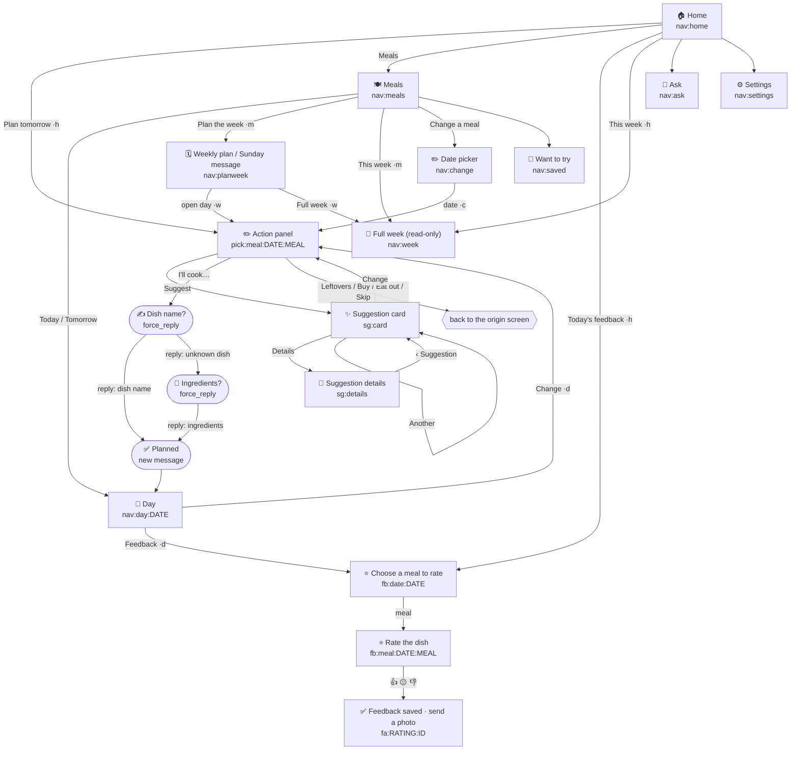

# Telegram menu state machine

Every panel is one Telegram message. Buttons edit the message they sit on;
only commands, replies, and photos create new messages. A screen is therefore
identified entirely by the `callback_data` that draws it.

## The origin letter

Most screens have more than one parent: the action panel is opened from Home,
from a day view, from the 14-day date picker, and from the Sunday plan message.
A fixed "‹ Back" target is right for one of those parents and wrong for the
rest — which is why Back used to land somewhere unrelated, most visibly from
the Sunday notification.

Every planning callback now carries one letter naming the screen it was opened
from, and Back resolves that letter:

| Letter | Origin screen | Back target |
| --- | --- | --- |
| `h` | Home dashboard | `nav:home` |
| `m` | Meals hub | `nav:meals` |
| `c` | Date picker | `nav:change` |
| `w` | Weekly dinner plan / Sunday message | `nav:planweek` |
| `d` | Day view | `nav:day:<date>` |
| *(none)* | button from an older message | `nav:day:<date>` |

The letter is the last segment of the callback (`pick:meal:2026-08-19:dinner:w`),
is validated on the way in, and is passed on to every button the screen draws,
so a whole planning chain keeps returning to where it started. Buttons sent
before this change carry no letter and fall back to that date's day view, which
is always related to what the button does.

## Screens

Dashed relationships in words — every screen's "‹ Back" button:

| Screen | Back | Home |
| --- | --- | --- |
| Home | — | refresh |
| Meals | — | ✓ |
| Day view | Meals | ✓ |
| Date picker | Meals | ✓ |
| Weekly plan | origin (absent in the Sunday message) | ✓ |
| Full week | origin | ✓ |
| Want to try | Meals | ✓ |
| Ask / Settings | — | ✓ |
| Action panel | origin | ✓ |
| Suggestion card / details | origin | ✓ |
| Choose a meal to rate | origin | ✓ |
| Rate the dish | Choose a meal to rate | ✓ |
| Feedback saved | origin | ✓ |
| Recipe preview / details / categories | ‹ Recipe (the import it belongs to) | ✓ |

Only dinner is planned, so `pick:date:DATE` opens the action panel directly
instead of a meal chooser holding a single button. `views.actionBack` puts the
chooser back into the chain automatically if `calendar.MEALS` ever grows again.

## Flows that were landing somewhere unrelated

| Flow | Was | Now |
| --- | --- | --- |
| Sunday message → open day → Leftovers / Buy / Eat out / Skip | the message was replaced by the Home dashboard, losing the week being planned | the weekly plan is redrawn with that dinner settled |
| Sunday message → Full week → Back | Meals hub | weekly plan |
| Home → Plan tomorrow → Back | the 14-day date picker, which the user never opened | Home |
| Day view → Change → Back | the 14-day date picker | that day |
| Day view → Change → Skip | Home dashboard | that day |
| Suggestion card and its details | no Back at all, only Home | origin |
| Feedback (choose meal, rate) | no Back at all, only Home | origin, then back up the feedback chain |
| Action panel → "‹ Choose meal" | a chooser screen with one button on it | origin |

Stale buttons are unchanged and still safe: dates in the past are rejected,
suggestions that are no longer pending are rejected, and both answer with an
alert instead of a new screen.

## "I'll cook…" and the shopping list

A dish typed in by hand has no recipe behind it, so the ingredient list the
shopping list needs is missing. The reply now resolves that before anything is
planned:

1. The dish is already stored **with ingredients** → planned, no model call.
2. Otherwise the model is asked for the dish's full ingredient list for the
   date's serving profile. It answers `known: false` rather than inventing a
   recipe for a name it does not recognise.
3. **Known** → planned, ingredients stored on the dish and echoed in the
   confirmation.
4. **Not known** → *nothing is planned*. A `force_reply` prompt asks for the
   ingredients, one per line, or for another dish through `/meals`. Replying
   plans the dish with exactly those ingredients.
5. **Model unreachable** → the dish is planned anyway (an outage must not block
   planning) and the same prompt asks for the ingredients.

Like the dish-name prompt, the ingredients prompt carries the dish, date, and
meal in its own text, so the round trip stores no conversation state.
